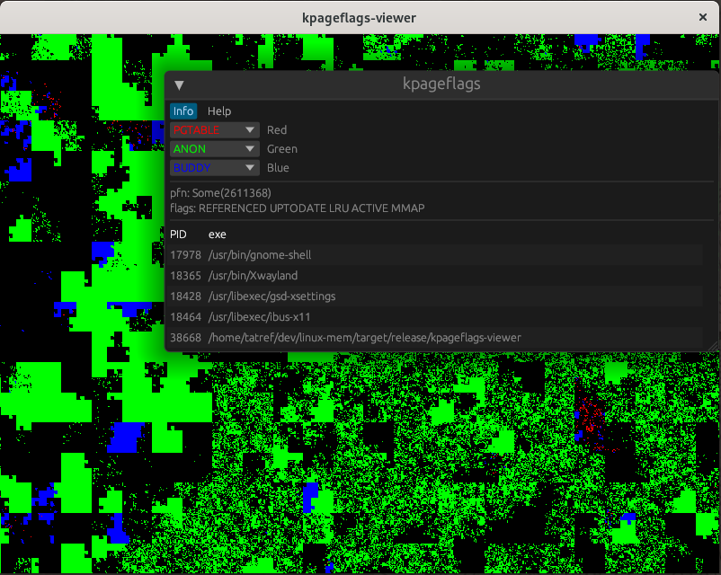

# Linux memory tools

A toolbox to inspect Linux memory

https://github.com/tatref/linux-mem


# Main tools
## [procinfo](src/bin/procinfo.rs)

Memory map details for single process. List virtual memory, physical pages, physical flags...

Information is grabbed from `/proc/<pid>/smaps`, `/proc/<pid>/pagemap`, `/proc/kpageflags`

Usage: `procinfo <pid...>`

```
# procinfo 12345
0x00007ff437847000-0x00007ff437849000 MMPermissions(NONE | READ | WRITE | PRIVATE) 0 Anonymous
PFN=0x0000159f83 MemoryPageFlags(SOFT_DIRTY | PRESENT | 0x159f83) / Some(PhysicalPageFlags(UPTODATE | LRU | MMAP | ANON | SWAPBACKED))
PFN=0x000010a5cb MemoryPageFlags(SOFT_DIRTY | PRESENT | 0x10a5cb) / Some(PhysicalPageFlags(UPTODATE | LRU | MMAP | ANON | SWAPBACKED))
stats: VSZ=8 kiB, RSS=8 kiB, SWAP=0 kiB
0x00007ff43784d000-0x00007ff437854000 MMPermissions(NONE | READ | SHARED) 160259 Path("/usr/lib64/gconv/gconv-modules.cache")
PFN=0x0000109d63 MemoryPageFlags(SOFT_DIRTY | FILE | PRESENT | 0x109d63) / Some(PhysicalPageFlags(REFERENCED | UPTODATE | LRU | ACTIVE | MMAP))
PFN=0x0000109d5b MemoryPageFlags(SOFT_DIRTY | FILE | PRESENT | 0x109d5b) / Some(PhysicalPageFlags(REFERENCED | UPTODATE | LRU | ACTIVE | MMAP))
```

## [snap.py](proc_snap/README.md)

/proc snapshot tool

## [memstats](docs/memstats.md)

Memory usage for groups of processes.
Main target is Oracle databases


┌─────────────────┬───────┬────────────┬────────────┬────────────┬───────────┬──────────┬──────────┬─────────────┬──────────┐
│ group_name      │ procs │ mem_rss    │ mem_anon   │ mem_uss    │ swap_anon │ swap_rss │ swap_uss │ shm_mem     │ shm_swap │
├─────────────────┼───────┼────────────┼────────────┼────────────┼───────────┼──────────┼──────────┼─────────────┼──────────┤
│ Some("+ASM1")   │ 102   │ 5209.41 MB │ 4636.65 MB │ 5179.87 MB │ 0 MB      │ 0 MB     │ 0 MB     │ 3213.41 MB  │ 0 MB     │
│ None            │ 74    │ 3790.02 MB │ 3536.86 MB │ 3765.41 MB │ 0.01 MB   │ 0.01 MB  │ 0.01 MB  │ 0 MB        │ 0 MB     │
│ Some("DBB1")    │ 109   │ 2357.09 MB │ 1489.36 MB │ 2216.93 MB │ 0 MB      │ 0 MB     │ 0 MB     │ 21479.03 MB │ 0 MB     │
│ Some("DBD1")    │ 90    │ 1614.49 MB │ 1101.75 MB │ 1470.30 MB │ 0 MB      │ 0 MB     │ 0 MB     │ 4299.16 MB  │ 0 MB     │
└─────────────────┴───────┴────────────┴────────────┴────────────┴───────────┴──────────┴──────────┴─────────────┴──────────┘


## [processes2png](src/bin/processes2png.rs)

Visual map of processes memory

For details, see [my blog post](https://tatref.github.io/blog/2023-visual-linux-memory-compact/)


Effect of memory compaction:


## [kpageflags](src/bin/kpageflags-v2.rs)

Visual map of physical memory with client/server modes





# Small tools
## [shmat](src/bin/shmat.rs)

Attach shared memory segments to current process

## [shmem](src/bin/shmem.rs)

Shared memory tool

## [connections](oracle-tools/src/bin/connections.rs)

Establish lots of connections to Oracle database

## [find_instances](oracle-tools/src/bin/find_instances.rs)

Find Oracle database instances, connect to DB and run some request. Env variables (SID, lib...) and user are found automatically.
